<div align="center">


<h1>Azure Virtual Desktop (AVD) Multi-Region Disaster Recovery</h1>

<p><strong>Enterprise Business Continuity & Automated Resilience Orchestration</strong></p>

[](https://devopstrio.co.uk/)
[](https://devopstrio.co.uk/)
[](https://devopstrio.co.uk/)
[](/apps/dr-engine)

</div>

---

## 🏛️ Executive Summary

The **AVD Multi-Region Disaster Recovery Platform** is a flagship enterprise solution architected for ultimate workspace resilience. In a globalized work environment, the loss of an Azure region can result in catastrophic productivity disruption. This platform provides the **Orchestration Control Plane** required to automate failover and failback of thousands of virtual desktops across geo-paired regions.

By integrating **real-time profile replication**, **host pool configuration sync**, and **automated DNS cutover**, the platform ensures that the workforce can transition from a failed region to a standby environment in minutes, satisfying even the most stringent RTO (Recovery Time Objective) and RPO (Recovery Point Objective) requirements.

### Strategic Business Outcomes
- **Guaranteed Workspace Continuity**: Ensure that critical business functions—from trading floors to call centers—remain operational during major cloud outages.
- **Automated Failover Orchestration**: Eliminate manual error and "hero culture" during crises with codified, one-click DR playbooks.
- **Continuous Readiness Validation**: Transition from "hope-based DR" to "evidence-based DR" with automated monthly failover tests and compliance scorecards.
- **Global Workforce Mobility**: Support follow-the-sun models and regional surge capacity during localized crises or infrastructure upgrades.

---

## 🏗️ Technical Architecture Details

### 1. High-Level Multi-Region Architecture
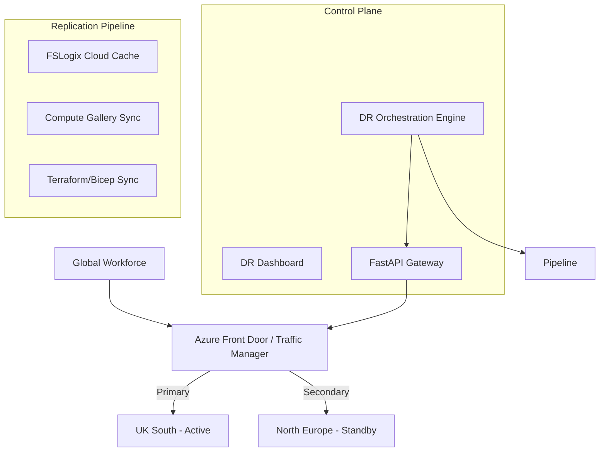

### 2. Region Failover Workflow
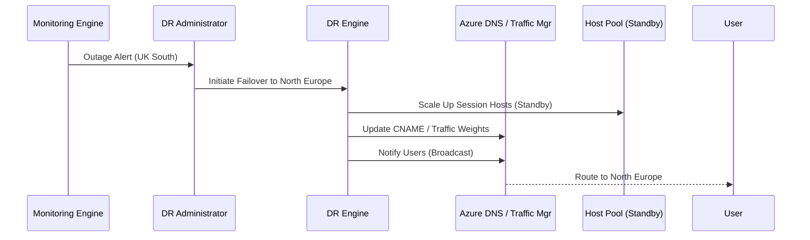

### 3. Failback Lifecycle
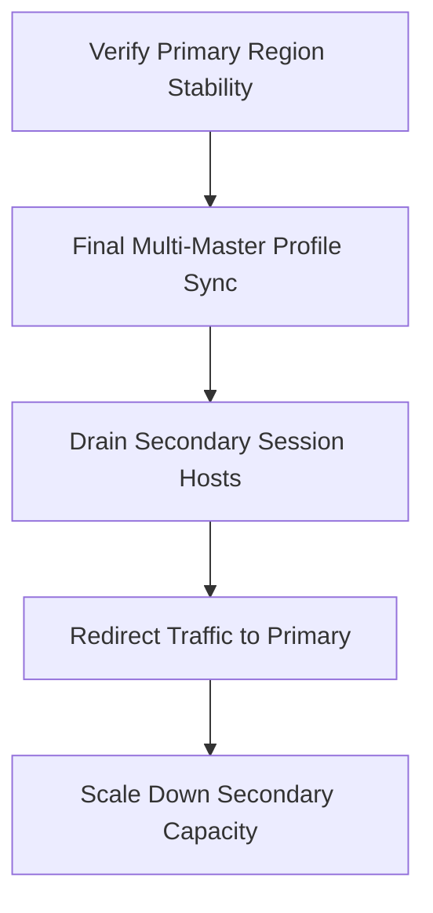

### 4. Profile Replication Flow (FSLogix)
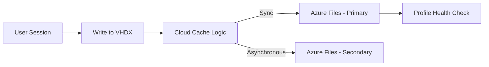

### 5. Capacity Reserve Model
```mermaid
graph TD
    Plan[Max Concurrency Plan] --> Reserved[Reserved Instances]
    Reserved --> Spot[Spot Burst (Optional)]
    Plan --> Cold[Cold Standby (0 Nodes)]
    Plan --> Warm[Warm Standby (10% Nodes)]
```

### 6. Security Trust Boundary
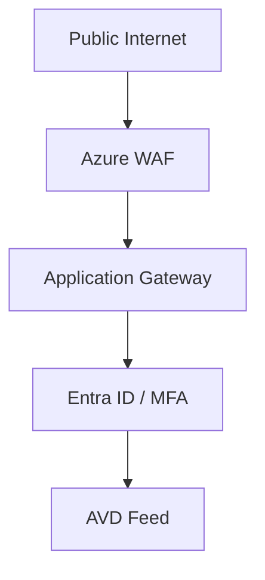

### 7. AVD Global Topology
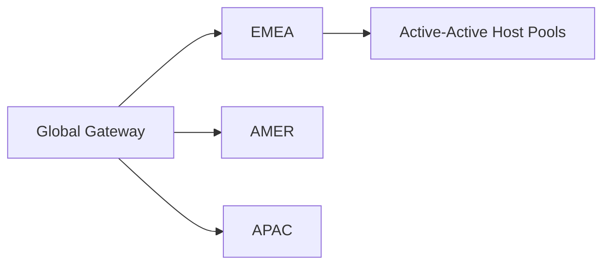

### 8. API Request Lifecycle
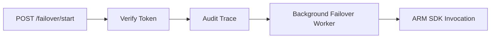

### 9. Multi-Tenant Tenancy Model
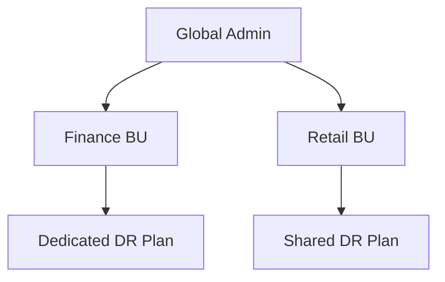

### 10. Monitoring & Telemetry Flow
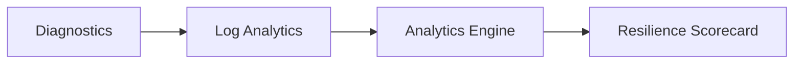

### 11. Disaster Recovery Topology
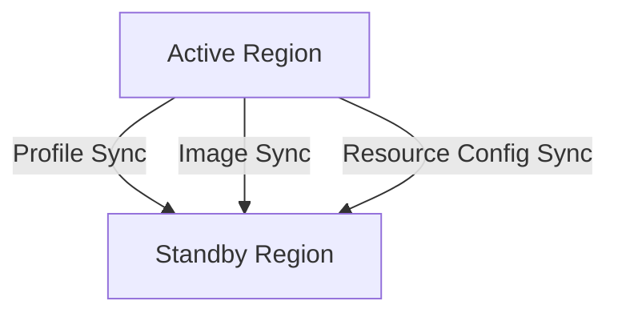

### 12. DNS Cutover Workflow
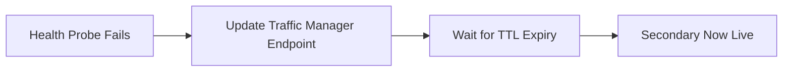

### 13. Identity Federation Model
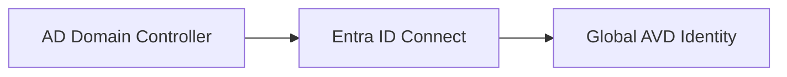

### 14. DR Test Lifecycle (Dry Run)
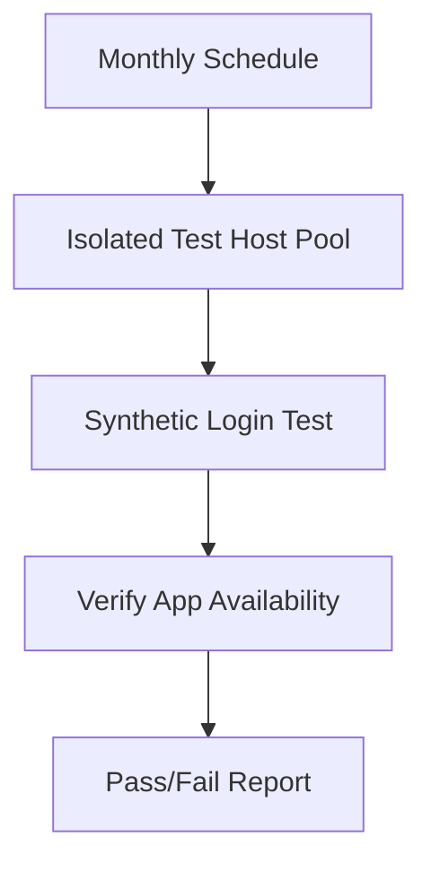

### 15. CI/CD Operations Pipeline
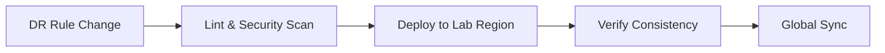

### 16. Executive Governance Workflow
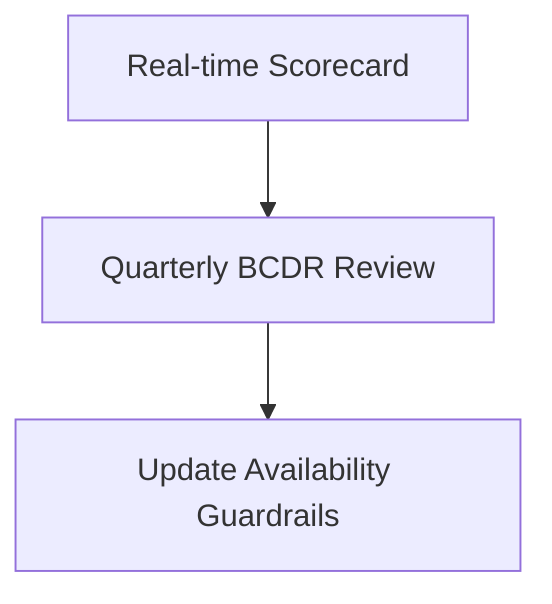

### 17. Contractor Emergency Access Model
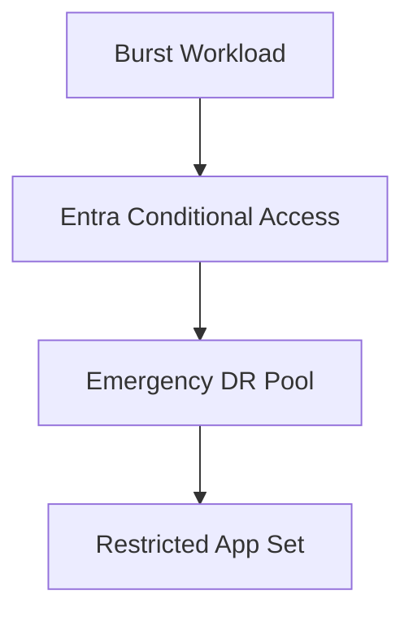

### 18. Storage Replication Workflow
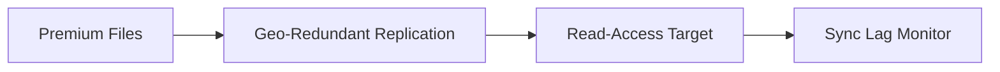

### 19. Global Region Topology
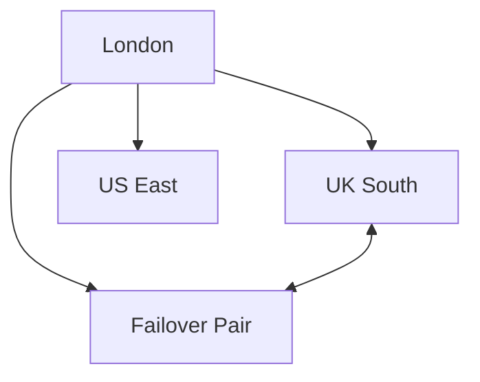

### 20. Resilience Score Workflow
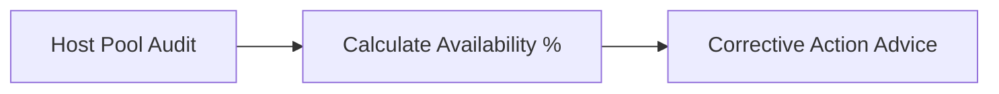

---

## 🚀 Image Diagram Prompts

1. **Executive AVD DR Infrastructure**: "Professional 3D isometric infographic showing two Azure regions connected by high-speed fiber, with data flowing synchronously between server racks. Labels for 'Active' and 'Standby' with a central glowing 'Orchestration Hub'. High-tech navy and emerald color palette."
2. **Global Multi-Region Workspace**: "A stylized world map with glowing nodes in London, New York, and Tokyo. Transparent lines showing real-time profile replication between nodes. Futuristic UI elements overlaying the map with 'DR Ready' status badges."
3. **Business Continuity Dashboard**: "A sleek, dark-themed dashboard UI showing regional health charts, a large 'Failover' button under glass protection, and RTO/RPO countdown timers. High-contrast typography and neon-accented gauges."

---

## 🚀 Environment Deployment

### Terraform Orchestration
```bash
cd terraform/environments/primary
terraform init
terraform apply -auto-approve
```

---
<sub>&copy; 2026 Devopstrio &mdash; Engineering Uninterrupted Global Workforce Productivity.</sub>
